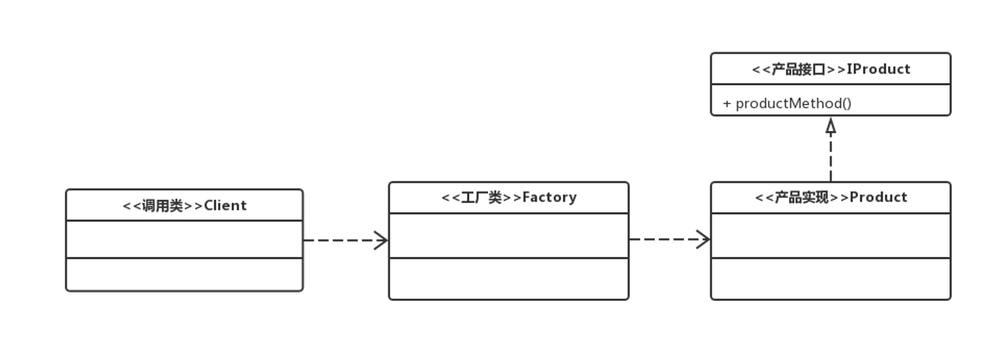
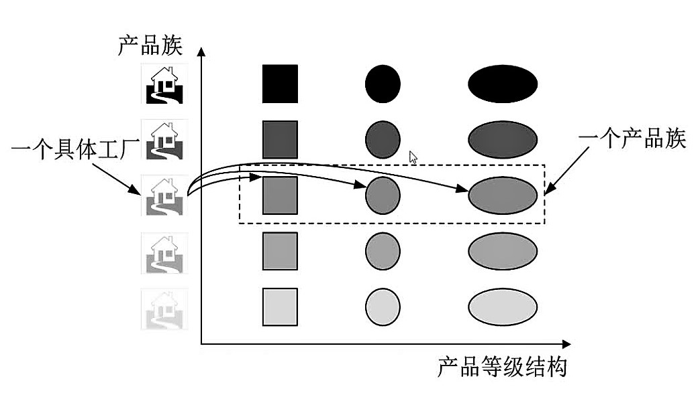
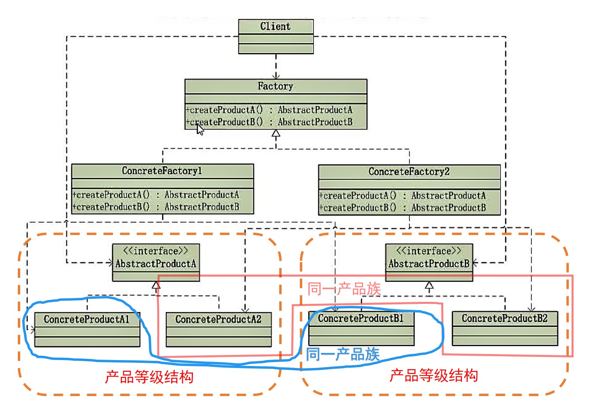

# 工厂模式（Factory Pattern）
## 一、认识工厂模式
### 1. 工厂模式类型
工厂模式包括：
- 工厂方法模式（Factory Method Pattern）
- 抽象工厂模式（Abstract Factory Pattern）

### 2. 工厂模式的作用
定义一个接口来创建对象，但是让子类决定实例化哪些类，即工厂方法吧实例化的工作推迟到子类中实现。

### 3. 工厂模式使用场景
1. 需要生成**复杂对象**的地方（复杂对象即该对象包含其他对象）；
2. 编码时不能预见需要创建哪种类的实例；
3. 系统需要具有扩展性。

## 二、工厂方法模式
类图

## 三、抽象工厂模式
抽象工厂模式是工厂方法模式的升级版本
1. 产品等级结构

2. 产品族
位于不同产品等级结构中功能相关联的产品组成的家族。

3. 产品等级结构与产品族的关系

4. 抽象工厂模式类图

## 四、工厂方法模式和抽象工厂模式对比
1. 抽象工厂模式是工厂方法模式的拓展，工厂方法模式是一种极端的抽象工厂模式。
2. 工厂方法模式针对一个产品等级结构，抽象工厂模式针对多个产品等级结构

## 五、扩展阅读
1. [工厂方法设计模式的最佳实践](http://www.importnew.com/10286.html)